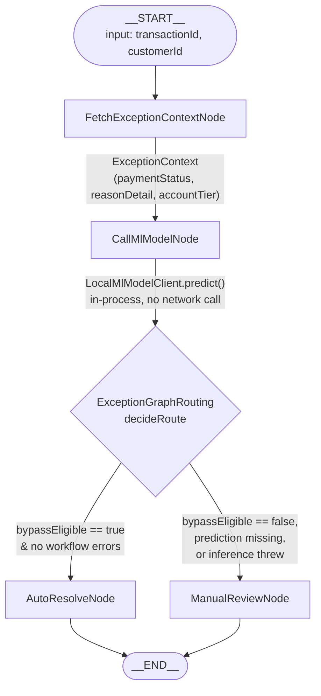

# Exception ML Graph — Embedded Local Model in a LangGraph Flow

> Companion to `langchain4j_demo_project_guide.md`. Documents the `org.example.exceptions` /
> `org.example.ml` packages: a `langgraph4j` workflow that classifies a payment exception using a
> ML model embedded in-process (ONNX Runtime), modeled on the `CallMlModelNode` pattern from the
> `convaservice-exceptions` design doc, adapted to this demo's banking-support domain.

---

## 1. What counts as an "exception" here

This demo has no dedicated exceptions service, but `PaymentService` already models the right
shape: transactions that are `SUCCESS`, `PENDING`, or `FAILED`. The graph treats any transaction
looked up by ID as a candidate exception and decides whether it can be closed automatically or
needs a human to look at it — the same "auto-resolvable vs. needs deeper review" decision the
original design makes, just against this app's data.

## 2. Graph flow



Node-by-node, mirroring the source doc's roles:

| Node | Class | Role |
|---|---|---|
| `fetchContext` | `FetchExceptionContextNode` | Calls `PaymentService.checkPaymentStatus` + `AccountService.getAccountTier`, builds an `ExceptionContext` |
| `callMlModel` | `CallMlModelNode` | The embedding point — asks `LocalMlModelClient.predict(context)` for a score. On any `RuntimeException`, catches it and records a workflow error instead of throwing (fail safe) |
| *(conditional edge)* | `ExceptionGraphRouting.decideRoute` | A workflow error always wins → `MANUAL_REVIEW`. Otherwise routes on `prediction.bypassEligible()`, defaulting to `MANUAL_REVIEW` if no prediction is present |
| `autoResolve` | `AutoResolveNode` | Terminal node: writes a resolution string when the model says no review is needed |
| `manualReview` | `ManualReviewNode` | Terminal node: writes a resolution string explaining why review is needed (error, low score, or no prediction) |

State is `ExceptionAgentState` (`org.bsc.langgraph4j.state.AgentState` subclass) with keys
`transactionId`, `customerId`, `exceptionContext`, `mlResult`, `workflowErrors`, `resolution`.

## 3. The embedded model itself

```
Offline, once per model version                    Inside this JVM (langchain4j-demo)
─────────────────────────────                       ────────────────────────────────
Train/hand-craft a model                             ExceptionAgentFactory.createProcessor()
        │                                              → MlModelConfig.fromEnvironment()
        ▼                                              → LocalMlModelClientFactory.create(config)
export/save to ONNX                                       EXCEPTION_ML_ENABLED=false (default)
        │                                                    → PlaceholderLocalMlModelClient
        ▼                                                      (always MANUAL_REVIEW, zero risk)
model file on the classpath                                EXCEPTION_ML_ENABLED=true
(src/main/resources/models/...)  ───────────────────────►      → OnnxLocalMlModelClient
                                                                   (loads the .onnx file once,
                                                                    ONNX Runtime, in-process,
                                                                    no network call per predict())
                                                                 load failure at any point
                                                                   → falls back to placeholder,
                                                                     never blocks startup
```

- `LocalMlModelClient` (`org.example.ml`) — the interface `CallMlModelNode` depends on:
  `predict(ExceptionContext) -> MlPrediction(label, bypassEligible, score, raw)`.
- `OnnxLocalMlModelClient` — real implementation. Reads a `float32[1,N]` tensor built from
  `ExceptionContext.features()` in the order given by `MlModelConfig.featureOrder()`, runs it
  through ONNX Runtime's Java bindings, and reads the last value of the output tensor as the
  bypass-eligible probability, compared against `bypassThreshold`.
- `PlaceholderLocalMlModelClient` — the safe default: always `MANUAL_REVIEW`, `bypassEligible =
  false`. Used until a real model is enabled, or if the real one fails to load.
- `MlModelConfig` — environment-driven toggle, no Spring in this app:

  | Env var | Default | Meaning |
  |---|---|---|
  | `EXCEPTION_ML_ENABLED` | `false` | turns on the real ONNX client |
  | `EXCEPTION_ML_MODEL_PATH` | `models/exception-bypass-classifier.onnx` | classpath (default) or `file:`-prefixed path |
  | `EXCEPTION_ML_FEATURE_ORDER` | `statusCode,accountTierCode,reasonLength` | must match the model's training-time column order |
  | `EXCEPTION_ML_BYPASS_THRESHOLD` | `0.5` | score cutoff for auto-resolve vs. manual review |
  | `EXCEPTION_ML_MODEL_VERSION` | `unversioned` | free-text tag surfaced in `MlPrediction.raw()` |

`ExceptionContext.features()` maps the fetched context to numbers the model can consume:
`statusCode` (`SUCCESS=0, PENDING=1, FAILED=2, other=-1`), `accountTierCode` (`STANDARD=0,
VIP=1, other=-1`), `reasonLength` (length of the status detail text).

## 4. The fixture model used to verify this end-to-end

No trained model exists for this demo (that step is explicitly Data Science's, per the source
doc). To prove the ONNX Runtime wiring actually works — not just the placeholder fallback — a
tiny **hand-crafted, not trained** logistic model was built directly with `onnx.helper`
(`Gemm` + `Sigmoid` over the 3 features above) and checked in at
`src/main/resources/models/exception-bypass-classifier.onnx` (also mirrored under
`src/test/resources/models/` for `OnnxLocalMlModelClientTest`). Weights: `FAILED` status and a
longer reason string push the score down; `VIP` tier nudges it up.

Verified live with `EXCEPTION_ML_ENABLED=true EXCEPTION_ML_MODEL_VERSION=fixture-v1 mvn exec:java
-Dexec.args="exceptions"`:

```
[Exception]: AUTO-RESOLVED TXN_001: score=0.698 (model=fixture-v1) - no manual review needed.
[Exception]: ROUTED TO MANUAL REVIEW TXN_002: score=0.079 below threshold
[Exception]: ROUTED TO MANUAL REVIEW TXN_003: score=0.354 below threshold
[Exception]: AUTO-RESOLVED TXN_999: score=0.924 (model=fixture-v1) - no manual review needed.
```

- `TXN_001` (`SUCCESS`, VIP) and `TXN_002` (`FAILED`, invalid-signature) land on opposite sides
  of the threshold, as designed.
- `TXN_999` (an unknown transaction ID — `PaymentService` returns `TRANSACTION_NOT_FOUND`, no
  " - " separator) scores high and auto-resolves. That's an artifact of the toy weights treating
  an unrecognized status the same as a "clean" one, not a real-model judgment call — a reminder
  that `feature-order`/weight correctness (Step 4 of the source doc) matters, and toy fixtures
  aren't a substitute for the parity check a real trained model needs.
- Also verified the fail-safe path: `EXCEPTION_ML_ENABLED=true` with no model file on the
  classpath logs a load failure and falls back to the placeholder rather than crashing.

## 5. Running it

```bash
# placeholder model (default) - always routes to manual review
mvn exec:java -Dexec.args="exceptions"

# real fixture ONNX model
EXCEPTION_ML_ENABLED=true mvn exec:java -Dexec.args="exceptions"
```

(`sdk env` first if `JAVA_HOME` isn't already pointed at the JDK 21+ toolchain — see
`langchain4j_demo_project_guide.md` / `CHANGES.md` for that quirk.)

## 6. Tests

| Test | Proves |
|---|---|
| `PlaceholderLocalMlModelClientTest` | placeholder always returns `MANUAL_REVIEW` |
| `OnnxLocalMlModelClientTest` | real ONNX Runtime inference against the fixture model - feature vector construction, score extraction, threshold routing |
| `CallMlModelNodeTest` | inference failure is caught and recorded as a workflow error, not thrown; success path stores the prediction |
| `ExceptionGraphRoutingTest` | routing decision table: error → manual review (even with a bypass-eligible prediction), bypass-eligible → auto-resolve, missing prediction → manual review |
| `ExceptionAgentGraphFactoryTest` | the compiled graph runs end-to-end with the placeholder client |

## 7. What's intentionally out of scope

Same boundary as the source design: no real trained model, no parity-check tooling, no
artifact-store pull at startup. `EXCEPTION_ML_ENABLED` defaults to `false` so nothing changes
until a real model is deliberately wired in.
