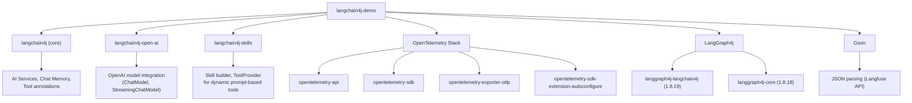
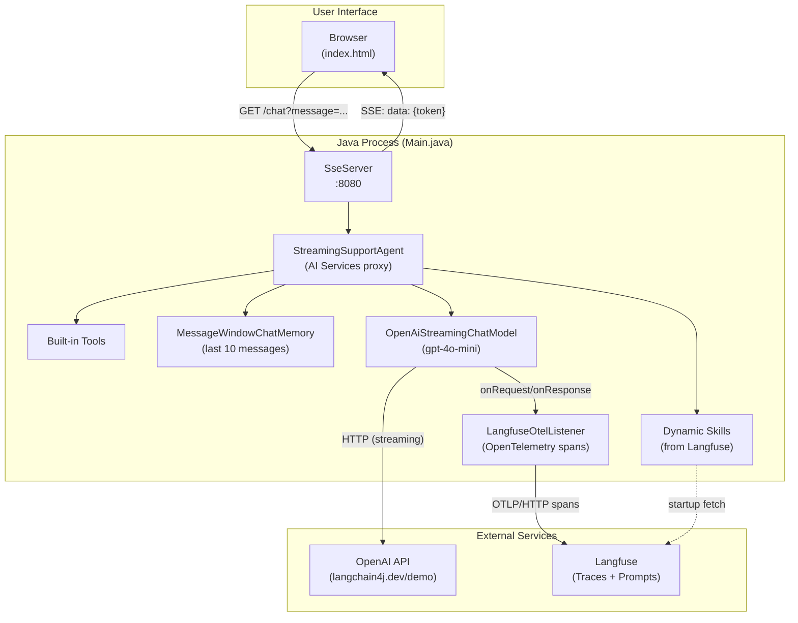
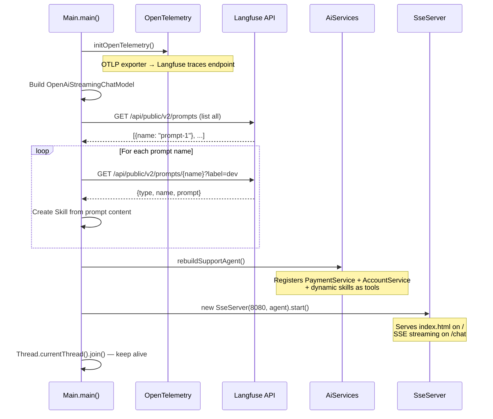
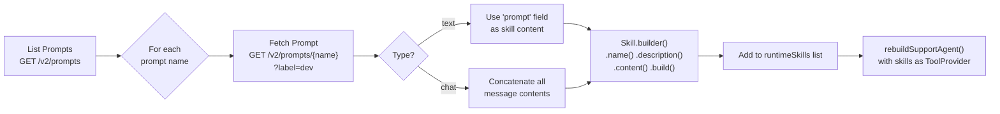
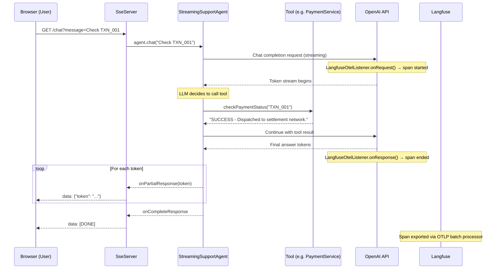

# LangChain4j Demo — Complete Project Guide

> **A comprehensive walkthrough from dependency management to application execution.**

---

## 1. Project Overview

`langchain4j-demo` is a **Java 17 Maven project** that builds an **AI-powered IT Support Chat Agent** using the [LangChain4j](https://github.com/langchain4j/langchain4j) framework. It combines:

- **LLM integration** via OpenAI's GPT-4o-mini model
- **Tool execution** — the LLM can call Java methods (payment lookups, security scans, etc.)
- **Dynamic skill loading** — prompts are fetched from [Langfuse](https://langfuse.com) at startup and injected as agent tools
- **Streaming responses** — real-time token-by-token output via Server-Sent Events (SSE)
- **Observability** — every LLM call is traced to Langfuse through OpenTelemetry (OTel)
- **Web Chat UI** — a self-contained HTML/CSS/JS chat interface served by the same process

---

## 2. Directory Structure

```
langchain4j-demo/
├── pom.xml                                  # Maven build & dependency config
├── .gitignore
└── src/
    └── main/
        ├── java/org/example/
        │   ├── Main.java                    # Application entry point
        │   ├── LangfuseConfig.java          # Centralised Langfuse credentials
        │   ├── LangfuseOtelListener.java    # OTel span listener for LLM calls
        │   ├── SseServer.java               # Embedded HTTP + SSE server
        │   └── service/
        │       ├── StreamingSupportAgent.java  # AI agent interface
        │       ├── AccountService.java         # Tool: account tier & security
        │       ├── PaymentService.java         # Tool: payment status lookup
        │       └── BankingState.java           # LangGraph agent state (unused placeholder)
        └── resources/
            ├── langfuse.properties           # Langfuse credentials & config
            └── index.html                    # Chat UI (served at http://localhost:8080)
```

---

## 3. Dependency Management (`pom.xml`)

The project uses **Maven** for builds. All versions are pinned via `<properties>`:

| Property | Value |
|---|---|
| `maven.compiler.source` / `target` | `17` (Java 17) |
| `langchain4j.version` | `1.16.1` |
| `opentelemetry.version` | `1.40.0` |

### 3.1 Dependencies Breakdown



| Dependency | Version | Purpose |
|---|---|---|
| `langchain4j` | 1.16.1 | Core framework — AI Services, chat memory, tool annotations |
| `langchain4j-open-ai` | 1.16.1 | OpenAI model connector (supports streaming) |
| `langchain4j-skills` | 1.17.1-beta27 | Dynamic skill/tool creation from prompts |
| `opentelemetry-api` | 1.40.0 | OTel tracing API for span creation |
| `opentelemetry-sdk` | 1.40.0 | OTel SDK runtime (TracerProvider, SpanProcessor) |
| `opentelemetry-exporter-otlp` | 1.40.0 | OTLP HTTP exporter to send traces to Langfuse |
| `opentelemetry-sdk-extension-autoconfigure` | 1.40.0 | Auto-configuration support for OTel SDK |
| `langgraph4j-langchain4j` | 1.8.19 | LangGraph integration with LangChain4j |
| `langgraph4j-core` | 1.8.18 | Core LangGraph state machine library |
| `gson` | 2.11.0 | JSON parsing for Langfuse REST API responses |

> [!NOTE]
> The LangGraph4j dependencies and `BankingState.java` are present but not actively used in the current agent flow. They serve as a scaffold for future graph-based workflow features.

---

## 4. Configuration

### 4.1 Langfuse Properties (`src/main/resources/langfuse.properties`)

```properties
langfuse.public-key=pk-lf-93853ba2-...
langfuse.secret-key=sk-lf-614b8c3e-...
langfuse.base-url=https://us.cloud.langfuse.com
langfuse.trace-name=chat-agent
```

### 4.2 Environment Variable Overrides

The following environment variables **override** the properties file values when set:

| Env Variable | Overrides Property | Purpose |
|---|---|---|
| `LANGFUSE_PUBLIC_KEY` | `langfuse.public-key` | Langfuse project public key |
| `LANGFUSE_SECRET_KEY` | `langfuse.secret-key` | Langfuse project secret key |
| `LANGFUSE_BASE_URL` | `langfuse.base-url` | Langfuse API base URL |
| `LANGFUSE_TRACE_NAME` | `langfuse.trace-name` | Trace grouping name in Langfuse |

### 4.3 How `LangfuseConfig.java` Works

[LangfuseConfig.java](file:///home/beehyv/LangChain4j/langchain4j-demo/src/main/java/org/example/LangfuseConfig.java) is a **static utility class** that:

1. Loads `langfuse.properties` from the classpath in a `static {}` block
2. Checks for environment variable overrides (`System.getenv().getOrDefault(...)`)
3. Derives computed values:
   - **`otlpEndpoint`** = `baseUrl + "/api/public/otel/v1/traces"`
   - **`basicAuthHeader`** = `"Basic " + Base64(publicKey:secretKey)`
4. Exposes everything via static methods: `publicKey()`, `secretKey()`, `baseUrl()`, `otlpEndpoint()`, `basicAuthHeader()`, `traceName()`

---

## 5. Application Architecture



---

## 6. Detailed Code Walkthrough

### 6.1 `Main.java` — Application Entry Point

[Main.java](file:///home/beehyv/LangChain4j/langchain4j-demo/src/main/java/org/example/Main.java) orchestrates the entire application. Here is the startup sequence:



#### Key Methods

| Method | Responsibility |
|---|---|
| `main()` | Initialises OTel, builds the model, loads skills, starts SSE server |
| `listLangfusePromptNames()` | `GET /api/public/v2/prompts` → extracts all prompt names |
| `fetchAndRegisterLangfuseSkill()` | Fetches a single prompt, parses it (chat or text type), creates a `Skill` |
| `fetchLangfusePrompt()` | Raw HTTP call to the Langfuse prompt API |
| `extractChatPromptContent()` | Joins `[{role, content}, ...]` chat prompt messages into a single string |
| `rebuildSupportAgent()` | Assembles `StreamingSupportAgent` with tools, skills, memory, and model |
| `initOpenTelemetry()` | Configures OTLP exporter + `SdkTracerProvider` |

---

### 6.2 `StreamingSupportAgent.java` — AI Agent Interface

[StreamingSupportAgent.java](file:///home/beehyv/LangChain4j/langchain4j-demo/src/main/java/org/example/service/StreamingSupportAgent.java)

```java
public interface StreamingSupportAgent {
    @SystemMessage({
        "You are a helpful and polite IT Support Assistant.",
        "Keep you answers short, concise and professional."
    })
    TokenStream chat(String message);
}
```

This is a **LangChain4j AI Service interface**. At runtime, `AiServices.builder(...)` generates a proxy implementation that:
- Sends the system message + user message to the LLM
- Returns a `TokenStream` for real-time streaming
- Automatically invokes registered `@Tool` methods when the LLM requests them

---

### 6.3 Tool Services

#### `PaymentService.java`
[PaymentService.java](file:///home/beehyv/LangChain4j/langchain4j-demo/src/main/java/org/example/service/PaymentService.java)

| Tool Method | Description | Sample Data |
|---|---|---|
| `checkPaymentStatus(transactionId)` | Looks up a transaction ID in an in-memory map | `TXN_001` → `SUCCESS`, `TXN_002` → `FAILED`, `TXN_003` → `PENDING` |

#### `AccountService.java`
[AccountService.java](file:///home/beehyv/LangChain4j/langchain4j-demo/src/main/java/org/example/service/AccountService.java)

| Tool Method | Description | Sample Data |
|---|---|---|
| `getAccountTier(customerId)` | Returns customer tier | `CUS_001` → `VIP`, `CUS_002` → `STANDARD` |
| `flagSecurityRisk(text)` | Checks for sensitive patterns (`SECRET_KEY`, `API_KEY`, `TOKEN`) | Returns `RISK_DETECTED` or `NO_RISK` |

> [!IMPORTANT]
> These services use **hardcoded in-memory `HashMap`s** for demo purposes. In production, they would connect to real databases or APIs.

---

### 6.4 Dynamic Skill Loading (Langfuse Integration)

The application **automatically discovers and loads prompts from Langfuse** at startup:



When skills are present, the agent receives a **system message** listing all available skills and instructions to use the `activate_skill` tool.

---

### 6.5 `LangfuseOtelListener.java` — Observability

[LangfuseOtelListener.java](file:///home/beehyv/LangChain4j/langchain4j-demo/src/main/java/org/example/LangfuseOtelListener.java) implements `ChatModelListener` to create OpenTelemetry spans for every LLM call:

| Lifecycle Method | What It Does |
|---|---|
| `onRequest()` | Creates a new `CLIENT` span, sets `gen_ai.*` attributes (model, system, operation), records prompt messages as an event |
| `onResponse()` | Records token usage (`input_tokens`, `output_tokens`), completion text, sets span status `OK`, ends span |
| `onError()` | Records the error, sets span status `ERROR`, ends span |

**Span Attributes Emitted:**

| Attribute | Example Value |
|---|---|
| `gen_ai.system` | `openai` |
| `gen_ai.operation.name` | `chat` |
| `gen_ai.request.model` | `gpt-4o-mini` |
| `langfuse.trace.name` | `chat-agent` |
| `gen_ai.usage.input_tokens` | `150` |
| `gen_ai.usage.output_tokens` | `80` |

These spans are exported to Langfuse via **OTLP/HTTP** through the `BatchSpanProcessor` → `OtlpHttpSpanExporter` pipeline configured in `initOpenTelemetry()`.

---

### 6.6 `SseServer.java` — Embedded HTTP Server

[SseServer.java](file:///home/beehyv/LangChain4j/langchain4j-demo/src/main/java/org/example/SseServer.java) is a lightweight server built on Java's built-in `com.sun.net.httpserver.HttpServer`:

| Endpoint | Method | Function |
|---|---|---|
| `GET /` | Static file | Serves `index.html` from classpath resources |
| `GET /chat?message=...` | SSE stream | Streams agent response token-by-token |

#### SSE Protocol

```
→ Client:   GET /chat?message=Hello
← Server:   Content-Type: text/event-stream

← data: {"token": "Hi"}

← data: {"token": " there"}

← data: {"token": "!"}

← data: [DONE]
```

- Each token is sent as `data: {"token": "..."}\n\n`
- Errors are sent as `data: {"error": "..."}\n\n`
- Stream termination is signaled by `data: [DONE]\n\n`

---

### 6.7 `index.html` — Chat UI

[index.html](file:///home/beehyv/LangChain4j/langchain4j-demo/src/main/resources/index.html) is a **self-contained single-page application** (no build tools required):

- **Dark theme** with glassmorphism and gradient accents
- **Streaming display** with a blinking cursor during token arrival
- **Typing indicator** (bouncing dots) while waiting for the first token
- **Suggestion chips** for quick-start queries
- **Auto-resizing** textarea input with Enter/Shift+Enter support
- **Error toasts** for connection failures
- Uses the native `EventSource` API to consume SSE

---

### 6.8 `BankingState.java` — LangGraph State (Placeholder)

[BankingState.java](file:///home/beehyv/LangChain4j/langchain4j-demo/src/main/java/org/example/service/BankingState.java)

A minimal extension of `AgentState` from LangGraph4j. Currently unused — present as a scaffold for future graph-based workflow features.

---

## 7. Data Flow — End to End



---

## 8. Building the Project

### Prerequisites

| Requirement | Minimum Version |
|---|---|
| Java JDK | 17+ |
| Apache Maven | 3.8+ |
| Internet access | Required (for Maven Central + OpenAI API) |

### Build Commands

```bash
# Navigate to project root
cd /home/beehyv/LangChain4j/langchain4j-demo

# Clean and compile
mvn clean compile

# Package as JAR (skip tests if none exist)
mvn clean package -DskipTests

# The JAR is created at:
# target/langchain4j-demo-1.0-SNAPSHOT.jar
```

---

## 9. Running the Application

### Option A: Run via Maven

```bash
mvn clean compile exec:java -Dexec.mainClass="org.example.Main"
```

### Option B: Run via IDE

1. Open the project in IntelliJ IDEA / VS Code
2. Navigate to `Main.java`
3. Click the green ▶ button next to `public static void main`

### Option C: Run the packaged JAR

```bash
# Build the fat JAR first (you may need to configure maven-shade-plugin or maven-assembly-plugin)
java -jar target/langchain4j-demo-1.0-SNAPSHOT.jar
```

> [!WARNING]
> The current `pom.xml` does not include a shade/assembly plugin, so running a plain JAR will fail with `ClassNotFoundException`. Use Option A or B for now.

### What Happens on Startup

```
=== Agent Online (Langfuse tracing enabled) ===
[System]: Fetching all prompts from Langfuse...
[System]: Found 3 prompt(s). Loading as skills...
[System]: Loaded skill 'greeting-prompt' (type=chat) from Langfuse prompt.
[System]: Loaded skill 'faq-handler' (type=text) from Langfuse prompt.
[System]: Loaded skill 'escalation-rules' (type=text) from Langfuse prompt.
[System]: 3 skill(s) loaded from Langfuse. Ready to chat!
[SSE Server]: Running on http://localhost:8080
[System]: Chat UI available at http://localhost:8080
```

### Accessing the Chat UI

Open your browser and navigate to:
```
http://localhost:8080
```

---

## 10. Environment Variables (Optional Overrides)

```bash
# Override Langfuse credentials (takes priority over langfuse.properties)
export LANGFUSE_PUBLIC_KEY="pk-lf-your-key"
export LANGFUSE_SECRET_KEY="sk-lf-your-key"
export LANGFUSE_BASE_URL="https://us.cloud.langfuse.com"
export LANGFUSE_TRACE_NAME="my-custom-trace"
```

---

## 11. Key Design Decisions

| Decision | Rationale |
|---|---|
| **Streaming model only** | Provides real-time UX; synchronous agent was removed in favor of `StreamingSupportAgent` |
| **Built-in `HttpServer`** | Zero extra dependencies for serving HTTP/SSE — no Spring Boot, no Jetty |
| **Langfuse as prompt store** | Single source of truth for skills; edit prompts in Langfuse UI without redeploying |
| **`?label=dev`** on prompt fetch | Fetches the `dev`-labelled version of prompts for development flexibility |
| **Chat memory: 10 messages** | `MessageWindowChatMemory.withMaxMessages(10)` — keeps context window small to control costs |
| **Shutdown hook for OTel flush** | Ensures pending spans are exported before process exits |

---

## 12. Quick Reference — File Responsibilities

| File | Lines | Role |
|---|---|---|
| [Main.java](file:///home/beehyv/LangChain4j/langchain4j-demo/src/main/java/org/example/Main.java) | 329 | Entry point, model setup, skill loading, agent assembly, SSE server launch |
| [LangfuseConfig.java](file:///home/beehyv/LangChain4j/langchain4j-demo/src/main/java/org/example/LangfuseConfig.java) | 89 | Centralised config loader (properties + env vars) |
| [LangfuseOtelListener.java](file:///home/beehyv/LangChain4j/langchain4j-demo/src/main/java/org/example/LangfuseOtelListener.java) | 140 | OTel span creation/management for LLM calls |
| [SseServer.java](file:///home/beehyv/LangChain4j/langchain4j-demo/src/main/java/org/example/SseServer.java) | 218 | HTTP server + SSE streaming endpoint |
| [StreamingSupportAgent.java](file:///home/beehyv/LangChain4j/langchain4j-demo/src/main/java/org/example/service/StreamingSupportAgent.java) | 14 | AI agent interface with system prompt |
| [PaymentService.java](file:///home/beehyv/LangChain4j/langchain4j-demo/src/main/java/org/example/service/PaymentService.java) | 24 | Tool: transaction status lookup |
| [AccountService.java](file:///home/beehyv/LangChain4j/langchain4j-demo/src/main/java/org/example/service/AccountService.java) | 32 | Tools: account tier lookup + security risk detection |
| [BankingState.java](file:///home/beehyv/LangChain4j/langchain4j-demo/src/main/java/org/example/service/BankingState.java) | 20 | LangGraph state (placeholder) |
| [langfuse.properties](file:///home/beehyv/LangChain4j/langchain4j-demo/src/main/resources/langfuse.properties) | 20 | Default Langfuse credentials |
| [index.html](file:///home/beehyv/LangChain4j/langchain4j-demo/src/main/resources/index.html) | 660 | Chat UI (dark theme, SSE-powered) |
| [pom.xml](file:///home/beehyv/LangChain4j/langchain4j-demo/pom.xml) | 72 | Maven build configuration |
